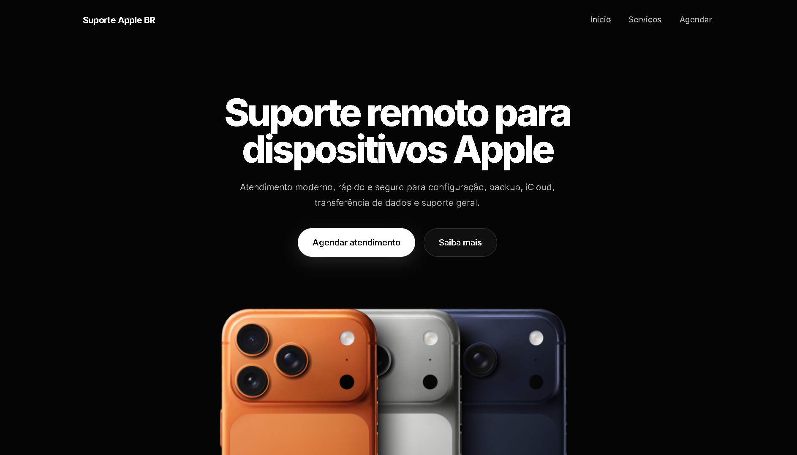

# Suporte Apple BR

Projeto front-end desenvolvido com foco em uma experiência visual simples, moderna e organizada para apresentação de um serviço de suporte remoto voltado a dispositivos Apple.

## 🔗 Acesso ao site

[Clique aqui para visualizar o projeto online](https://remanyw0.github.io/suporteapple.com.br/)

## 🖼️ Prévia do projeto

## 📌 Visão geral

O objetivo deste projeto foi criar um site claro e agradável, capaz de apresentar os serviços oferecidos e conduzir o usuário até a etapa de agendamento de forma direta.

A construção da interface foi pensada para transmitir organização, confiança e facilidade de uso, com navegação intuitiva e adaptação para diferentes tamanhos de tela.

## 🖥️ O que o projeto apresenta

- Página inicial com apresentação do serviço
- Seção com os principais tipos de suporte
- Área de destaque para agendamento
- Formulário de atendimento
- Página de confirmação após o envio

## ✨ Destaques do projeto

- Visual limpo e moderno
- Estrutura organizada e de fácil navegação
- Layout responsivo para desktop e mobile
- Formulário com preenchimento simples e objetivo

## 🛠️ Tecnologias utilizadas

- HTML
- CSS

## 📁 Estrutura do projeto

- `index.html`
- `style.css`
- `abas/agendamento.html`
- `abas/agendamento.css`
- `abas/sucesso.html`
- `abas/sucesso.css`

## 🎯 Finalidade

Este projeto foi desenvolvido como parte do meu processo de aprendizagem em desenvolvimento front-end, com foco em estruturação de páginas, organização visual e construção de interfaces responsivas.

Ele representa um dos meus projetos iniciais e marca uma etapa importante da minha evolução prática com HTML e CSS.

## ✅ Status

Projeto concluído para fins de estudo, apresentação e composição de portfólio inicial.
